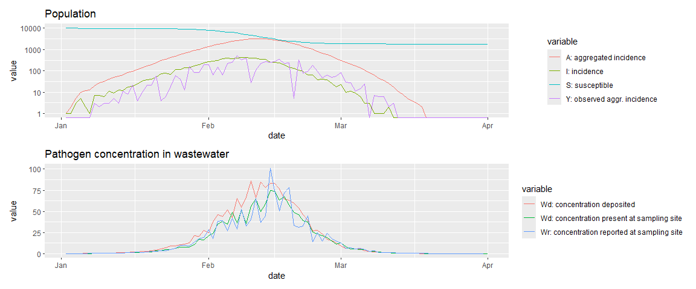

The name of this R package, `reem`, stands for: **R**enewal **E**quation
based **E**pidemic **M**odel

This package simulates and fits infectious disease epidemic to clinical
and wastewater data.

To install: `devtools::install_github("phac-nml-phrsd/reem")`

## Model description

The epidemic model is a traditional SIR model but implemented as a
renewal equation instead of the more populate ordinary differential
equations (ODE). It has been shown that the renewal equation
implementation is equivalent to the ODE one. See for example: D. Fargue,
Reducibilite des systemes hereditaires, Int. J. Nonlinear Mech., 9
(1974), pp. 331–338, D. Breda et al On the formulation of epidemic
models (an appraisal of Kermack and McKendrick), J. Biol. Dyn.,6 (2012),
pp. 103–117, and Champredon et al. Equivalence of the Erlang-Distributed
SEIR Epidemic Model and the Renewal Equation, SIAM J. Appl. Math., 78
(2018).

The renewal equation of the pathogen transmission process is as follows:

where is the incidence at time , TO FINISH…

## Simulation example

The code below simulates an epidemic, tracking the spread in the
population and the pathogen concentration in the wastewater.

``` r
library(reem)
library(lubridate)
```

    ## 
    ## Attaching package: 'lubridate'

    ## The following objects are masked from 'package:base':
    ## 
    ##     date, intersect, setdiff, union

``` r
library(patchwork)

# Define model parameters

prms = list(
  horizon  = 90,  # horizon of the simulation
  last.obs = 88,  # last observation time (must be < horizon)
  B        = rep(1,90), # time dependent multiplicative factor for transmission
  i0prop  = 1e-3,  # initial proportion of the population infected
  date.start = lubridate::ymd('2022-01-01'), # start date of the epidemic
  start.delta = 0, 
  R0      = 1.5, # Basic reproduction number
  N       = 1e4, # population size
  alpha   = -10, # transmission heterogeneity (alpha=-Inf: homogeneous)
  I.init  = c(1,1,3,5), # initial incidence (overwritten in fit ABC)
  lag     = 7,   # Aggregation window for clinical reports
  rho     = 0.1, # mean reporting ratio
  g       = get_gi(), # Generation interval distribution
  fec     = get_fecalshed(), # fecal shedding kinetics
  kappa   = 0.18, # pathogen decay in ww
  psi     = get_psi(), # plug flow simulation,
  shed.mult = 0.2 # deposited fecal shedding multiplier  
)

# Create the model object instance
obj = new('reem', 
          name = 'foo', 
          prms = prms, 
          is.fitted = FALSE)

# Print (formatted) the model parameters
obj$print_prms()
```

    ## 
    ## --- Parameters for REEM ` foo `
    ## horizon  =  90 
    ## last.obs  =  88 
    ## B  =  1 1 1 1 1 1 1 1 1 1 1 1 1 1 1 1 1 1 1 1 1 1 1 1 1 1 1 1 1 1 1 1 1 1 1 1 1 1 1 1 1 1 1 1 1 1 1 1 1 1 1 1 1 1 1 1 1 1 1 1 1 1 1 1 1 1 1 1 1 1 1 1 1 1 1 1 1 1 1 1 1 1 1 1 1 1 1 1 1 1 
    ## i0prop  =  0.001 
    ## date.start  =  18993 
    ## start.delta  =  0 
    ## R0  =  1.5 
    ## N  =  10000 
    ## alpha  =  -10 
    ## I.init  =  1 1 3 5 
    ## lag  =  7 
    ## rho  =  0.1 
    ## g  =  0 0.02432345 0.3100143 0.3955746 0.1967229 0.05837831 0.01249735 0.002135546 0.000309429 3.952736e-05 4.571663e-06 
    ## fec  =  0.001341379 0.04085834 0.1509359 0.2350638 0.2280526 0.1640111 0.09593837 0.04824391 0.02161408 0.008840312 0.003358844 0.001200831 0.0004079245 0.0001326712 
    ## kappa  =  0.18 
    ## psi  =  0.85 0.1 0.05 
    ## shed.mult  =  0.2 
    ##  --------------------------

``` r
# Simulate an epidemic based on the parameters
simepi  = obj$simulate_epi(deterministic = FALSE)
```

We can use the built-in function `plot_epi()` to plot the epidemic

``` r
g = plot_epi(simepi)
plot(patchwork::wrap_plots(g, ncol = 1))
```

<!-- -->

`devtools::build_readme()`

## Fit example

((TO DO))
