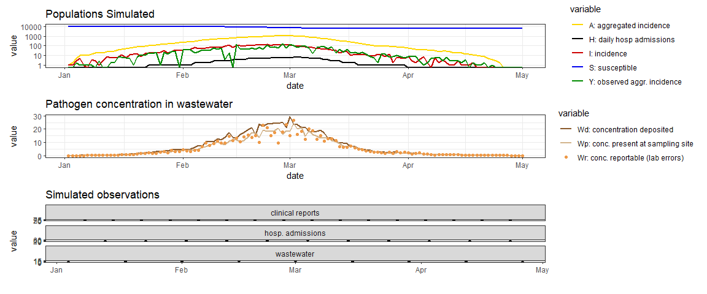

The name of this R package, `reem`, stands for: **R**enewal **E**quation
based **E**pidemic **M**odel

This package simulates and fits infectious disease epidemic to clinical
and wastewater data.

To install: `devtools::install_github("phac-nml-phrsd/reem")`

## Model description

((TO DO))

## Simulation example

The code below simulates an epidemic, tracking the spread in the
population and the pathogen concentration in the wastewater.

    ## 
    ## Attaching package: 'lubridate'

    ## The following objects are masked from 'package:base':
    ## 
    ##     date, intersect, setdiff, union

    ## 
    ## --- Parameters for REEM ` foo `
    ## horizon  =  300 
    ## last.obs  =  299 
    ## B  =  1 1 1 1 1 1 1 1 1 1 1 1 1 1 1 1 1 1 1 1 1 1 1 1 1 1 1 1 1 1 1 1 1 1 1 1 1 1 1 1 1 1 1 1 1 1 1 1 1 1 1 1 1 1 1 1 1 1 1 1 1 1 1 1 1 1 1 1 1 1 1 1 1 1 1 1 1 1 1 1 1 1 1 1 1 1 1 1 1 1 1 1 1 1 1 1 1 1 1 1 1 1 1 1 1 1 1 1 1 1 1 1 1 1 1 1 1 1 1 1 1 1 1 1 1 1 1 1 1 1 1 1 1 1 1 1 1 1 1 1 1 1 1 1 1 1 1 1 1 1 1 1 1 1 1 1 1 1 1 1 1 1 1 1 1 1 1 1 1 1 1 1 1 1 1 1 1 1 1 1 1 1 1 1 1 1 1 1 1 1 1 1 1 1 1 1 1 1 1 1 1 1 1 1 1 1 1 1 1 1 1 1 1 1 1 1 1 1 1 1 1 1 1 1 1 1 1 1 1 1 1 1 1 1 1 1 1 1 1 1 1 1 1 1 1 1 1 1 1 1 1 1 1 1 1 1 1 1 1 1 1 1 1 1 1 1 1 1 1 1 1 1 1 1 1 1 1 1 1 1 1 1 1 1 1 1 1 1 1 1 1 1 1 1 1 1 1 1 1 1 
    ## i0prop  =  0.001 
    ## date.start  =  18993 
    ## start.delta  =  0 
    ## R0  =  1.5 
    ## N  =  10000 
    ## alpha  =  -10 
    ## I.init  =  1 1 3 5 
    ## lag  =  7 
    ## rho  =  0.1 
    ## g  =  0 0.02432345 0.3100143 0.3955746 0.1967229 0.05837831 0.01249735 0.002135546 0.000309429 3.952736e-05 4.571663e-06 
    ## fec  =  0.001341379 0.04085834 0.1509359 0.2350638 0.2280526 0.1640111 0.09593837 0.04824391 0.02161408 0.008840312 0.003358844 0.001200831 0.0004079245 0.0001326712 
    ## kappa  =  0.18 
    ## psi  =  0.85 0.1 0.05 
    ## shed.mult  =  0.2 
    ##  --------------------------

We can use the built-in function `plot_epi()` to plot the epidemic

``` r
g = plot_epi(simepi)
plot(patchwork::wrap_plots(g, ncol = 1))
```

<!-- -->

`devtools::build_readme()`

## Fit example

((TO DO))
