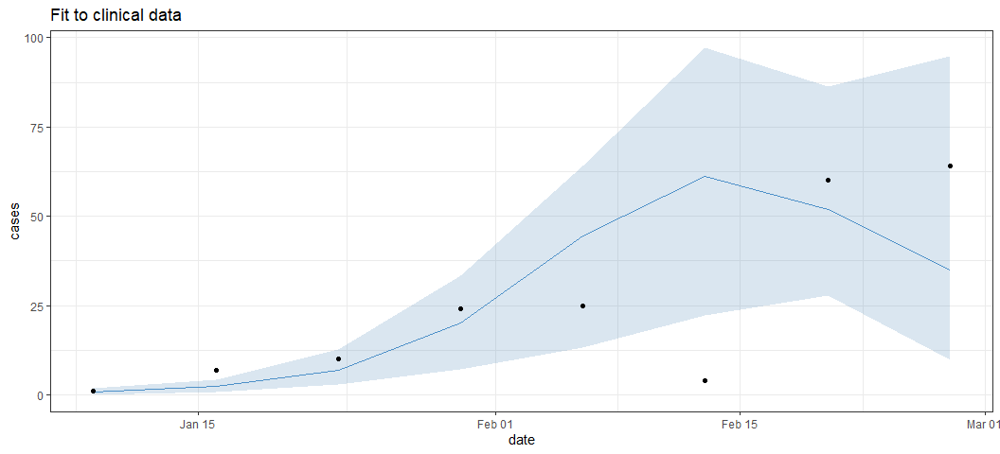
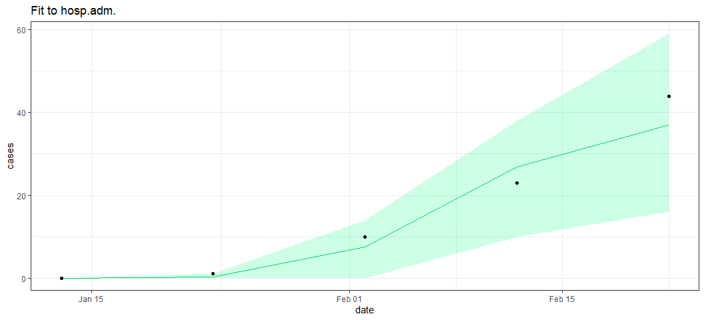

The name of this R package, `reem`, stands for: **R**enewal **E**quation
based **E**pidemic **M**odel

This package simulates and fits infectious disease epidemic to clinical
and wastewater data.

To install: `devtools::install_github("phac-nml-phrsd/reem")`

**Note:** This package implements the model as a **Reference Class**.
This is a way to access the Object Oriented Programming functionalities
in R. Developers, if you are not familiar with Reference Classes in R,
please see this [very short
introduction](https://www.datamentor.io/r-programming/reference-class)
and [Hadley Wickham’s](http://adv-r.had.co.nz/R5.html) course for more
details.

## Model description

The epidemic model is a traditional SIR model but implemented as a
renewal equation instead of the more populate ordinary differential
equations (ODE). It has been shown that the renewal equation
implementation is equivalent to the ODE one. See for example: D. Fargue,
Reducibilite des systemes hereditaires, Int. J. Nonlinear Mech., 9
(1974), pp. 331–338, D. Breda et al On the formulation of epidemic
models (an appraisal of Kermack and McKendrick), J. Biol. Dyn.,6 (2012),
pp. 103–117, and Champredon et al. Equivalence of the Erlang-Distributed
SEIR Epidemic Model and the Renewal Equation, SIAM J. Appl. Math., 78
(2018).

The renewal equation of the pathogen transmission process is as follows:

$$i(t) = \left(\frac{S(t)}{N}\right)^{\exp(\alpha)}\, \mathcal{R}_0 \, B(t) \sum_{k=1}^\ell g(k)i(t-k)$$

$$S(t) = \max(0, S(t-1) - i(t))$$

where $i(t)$ is the incidence at time $t$, $\mathcal{R}_0$ is the basic
reproduction number, $S_t$ are the number of susceptible individuals at
time $t$, $N$ is the total population size, $g$ is the intrinsic
generation interval distribution and $B$ a function to change the
transmission rate with respect to time (e.g., to implement public health
measures, vaccination campaigns, etc.).

## Simulation example

The code below simulates an epidemic, tracking the spread in the
population and the pathogen concentration in the wastewater.

``` r
library(reem)
library(snowfall)
library(lubridate)
library(dplyr)
library(tidyr)
library(ggplot2)
```

``` r
# Define model parameters

date.start = ymd('2022-01-01')
hz = 120

# Behavior change, 
# time dependent multiplicative factor for transmission
B.date = date.start + c(-20:(hz+20)) # define beyond date.start +/- delta.start to avoid warnings
date.break = ymd('2022-03-01')
B = data.frame(date = B.date, mult = rep(1,length(B.date))) |>
  mutate(mult = if_else(date >= date.break, 0.8, mult))

prms = list(
  horizon  = hz,  # horizon of the simulation
  last.obs = hz-1,  # last observation time (must be < horizon)
  B        = B, # 
  i0prop  = 1e-3,  # initial proportion of the population infected
  date.start = date.start, # start date of the epidemic
  date.obs.cl = date.start + seq(7,hz-2, by = 7),
  date.obs.ha = date.start + seq(12,hz-2, by = 10),
  date.obs.ww = date.start + seq(3,hz-2, by=14),
  # NOTE: 
    # `start.delta` (below) is used only during fitting 
    # (it is ignored for simple simulation).
    # `start.delta` is created to conveniently fit the 
    # start date of an epidemic.
    # If the user wants to change the date for a simulation,
    # this must be done by updating `obj$prms$date.start` directly.
  start.delta = 0, 
  R0      = 1.5, # Basic reproduction number
  N       = 1e4, # population size
  alpha   = 0.3, # transmission heterogeneity (alpha=0: homogeneous)
  I.init  = c(1,1,3,5), # initial incidence (overwritten in fit ABC)
  lag     = 7,   # Aggregation window for clinical reports
  rho     = 0.1, # mean reporting ratio
  g       = get_gi(), # Generation interval distribution
  fec     = get_fecalshed(), # fecal shedding kinetics
  h.prop  = 0.05, # total proportion hospitalized for one cohort
  h.lags  = c(rep(0,3), 1, 2, 2, 1, 0), # Lag infection-hospitalization
  kappa   = 0.18, # pathogen decay in ww
  psi     = get_psi(), # plug flow simulation,
  shed.mult = 0.2 # deposited fecal shedding multiplier  
)

# Create the model object instance
obj = new('reem', 
          name = 'foo', 
          prms = prms, 
          is.fitted = FALSE)

# Print (formatted) the model parameters
obj$print_prms()
```

    ## [1] "--- Parameters for REEM `foo`"
    ## [1] "horizon  =  120"
    ## [1] "last.obs  =  119"
    ## [1] "B  =  c(18973, 18974, 18975, 18976, 18977, 18978, 18979, 18980, 18981, 18982, 18983, 18984, 18985, 18986, 18987, 18988, 18989, 18990, 18991, 18992, 18993, 18994, 18995, 18996, 18997, 18998, 18999, 19000, 19001, 19002, 19003, 19004, 19005, 19006, 19007, 19008, 19009, 19010, 19011, 19012, 19013, 19014, 19015, 19016, 19017, 19018, 19019, 19020, 19021, 19022, 19023, 19024, 19025, 19026, 19027, 19028, 19029, 19030, 19031, 19032, 19033, 19034, 19035, 19036, 19037, 19038, 19039, 19040, 19041, 19042, 19043, 19044, \n19045, 19046, 19047, 19048, 19049, 19050, 19051, 19052, 19053, 19054, 19055, 19056, 19057, 19058, 19059, 19060, 19061, 19062, 19063, 19064, 19065, 19066, 19067, 19068, 19069, 19070, 19071, 19072, 19073, 19074, 19075, 19076, 19077, 19078, 19079, 19080, 19081, 19082, 19083, 19084, 19085, 19086, 19087, 19088, 19089, 19090, 19091, 19092, 19093, 19094, 19095, 19096, 19097, 19098, 19099, 19100, 19101, 19102, 19103, 19104, 19105, 19106, 19107, 19108, 19109, 19110, 19111, 19112, 19113, 19114, 19115, 19116, \n19117, 19118, 19119, 19120, 19121, 19122, 19123, 19124, 19125, 19126, 19127, 19128, 19129, 19130, 19131, 19132, 19133) c(1, 1, 1, 1, 1, 1, 1, 1, 1, 1, 1, 1, 1, 1, 1, 1, 1, 1, 1, 1, 1, 1, 1, 1, 1, 1, 1, 1, 1, 1, 1, 1, 1, 1, 1, 1, 1, 1, 1, 1, 1, 1, 1, 1, 1, 1, 1, 1, 1, 1, 1, 1, 1, 1, 1, 1, 1, 1, 1, 1, 1, 1, 1, 1, 1, 1, 1, 1, 1, 1, 1, 1, 1, 1, 1, 1, 1, 1, 1, 0.8, 0.8, 0.8, 0.8, 0.8, 0.8, 0.8, 0.8, 0.8, 0.8, 0.8, 0.8, 0.8, 0.8, 0.8, 0.8, 0.8, 0.8, 0.8, 0.8, 0.8, 0.8, 0.8, 0.8, 0.8, 0.8, 0.8, 0.8, 0.8, 0.8, 0.8, 0.8, 0.8, 0.8, 0.8, 0.8, 0.8, 0.8, 0.8, 0.8, 0.8, 0.8, 0.8, 0.8, 0.8, 0.8, 0.8, 0.8, 0.8, 0.8, 0.8, 0.8, 0.8, \n0.8, 0.8, 0.8, 0.8, 0.8, 0.8, 0.8, 0.8, 0.8, 0.8, 0.8, 0.8, 0.8, 0.8, 0.8, 0.8, 0.8, 0.8, 0.8, 0.8, 0.8, 0.8, 0.8, 0.8, 0.8, 0.8, 0.8, 0.8, 0.8)"
    ## [1] "i0prop  =  0.001"
    ## [1] "date.start  =  2022-01-01"
    ## [1] "date.obs.cl  =  2022-01-08 2022-01-15 2022-01-22 2022-01-29 2022-02-05 2022-02-12 2022-02-19 2022-02-26 2022-03-05 2022-03-12 2022-03-19 2022-03-26 2022-04-02 2022-04-09 2022-04-16 2022-04-23"
    ## [1] "date.obs.ha  =  2022-01-13 2022-01-23 2022-02-02 2022-02-12 2022-02-22 2022-03-04 2022-03-14 2022-03-24 2022-04-03 2022-04-13 2022-04-23"
    ## [1] "date.obs.ww  =  2022-01-04 2022-01-18 2022-02-01 2022-02-15 2022-03-01 2022-03-15 2022-03-29 2022-04-12 2022-04-26"
    ## [1] "start.delta  =  0"
    ## [1] "R0  =  1.5"
    ## [1] "N  =  10000"
    ## [1] "alpha  =  0.3"
    ## [1] "I.init  =  1 1 3 5"
    ## [1] "lag  =  7"
    ## [1] "rho  =  0.1"
    ## [1] "g  =  0 0.0243234546096934 0.310014335384433 0.395574605155377 0.196722869409776 0.0583783087064439 0.012497352838116 0.00213554586302256 0.000309429013608888 3.95273561429204e-05 4.57166338566992e-06"
    ## [1] "fec  =  0.00134137901554801 0.0408583357618263 0.15093586091606 0.235063772361137 0.228052582048147 0.164011132815058 0.0959383656310772 0.0482439053838456 0.0216140831805828 0.00884031240675856 0.003358844003011 0.00120083077846915 0.000407924497133254 0.00013267120134534"
    ## [1] "h.prop  =  0.05"
    ## [1] "h.lags  =  0 0 0 1 2 2 1 0"
    ## [1] "kappa  =  0.18"
    ## [1] "psi  =  0.85 0.1 0.05"
    ## [1] "shed.mult  =  0.2"
    ## [1] " --------------------------"

``` r
# Simulate an epidemic based on the parameters
simepi  = obj$simulate_epi(deterministic = FALSE)
```

We can use the built-in function `plot_epi()` to plot the epidemic

``` r
g = plot_epi(simepi)
plot(patchwork::wrap_plots(g, ncol = 1))
```

<!-- -->

We can also check the behavior change parameterization is working as
expected:

``` r
plot(g$populations + geom_vline(xintercept = date.break, linetype = 'dashed'))
```

    ## Warning in ggplot2::scale_y_log10(): log-10 transformation introduced infinite
    ## values.

<!-- -->

## Fit example

If we attach observation data (from clinical and/or wastewater
surveillance), to a `reem` object, then it is possible to fit its model
parameters to these data. The example below shows how to do this.

First, let’s create synthetic observation data from the simulation
example above. We use synthetic data (as opposed to real data) because
we to assess the accuracy of the fit. The synthetic data are generated
from the very same model `reem` where we know all the parameters.

``` r
# we use the example above and make a copy of its
# simulated epidemics. The time series will be the "observations".

sim.data = simepi

# Set the date for "today"
asof = ymd('2022-03-01') 

# Retrieve the simulated observations
obs.cl = dplyr::filter(sim.data$obs.cl, date <= asof)
obs.ww = dplyr::filter(simepi$obs.ww, date <= asof)
obs.ha = dplyr::filter(simepi$obs.ha, date <= asof)

# shift the dates such that they 
# do not perfectly align with the simulation
obs.cl$t <- obs.cl$t + 1
obs.cl$date <- obs.cl$date + 1

# Attached (simulated) data to new `reem` object:
prms$t.obs.cl <- NULL
prms$t.obs.ha <- NULL
prms$t.obs.ww <- NULL
obj  = new('reem', 
           name = 'foo2', 
           prms = prms, 
           obs.cl = obs.cl,
           obs.ha = obs.ha,
           obs.ww = obs.ww,
           is.fitted = FALSE)
```

Now, we set up the fitting algorithm. This algorithm is an Approximate
Bayesian Computation (ABC), which is a very straightforward and robust
Bayesian method but not very efficient.

``` r
# Define the parameters for the ABC fitting algorithm
prm.abc = list(
  n.abc = 500,   # Total number of ABC iterations (the larger the better)
  n.sim = 0,     # Number of simulation for a given set of prior parameters. `0` for deterministic, else`8` should be enough
  p.abc = 0.02,  # Acceptance probability (the lower the better)
  n.cores = 1,   # number of cores used for parallel computing
  use.cl = TRUE, # use clinical observations in the fit?
  use.ha = TRUE, # use hospital admissions in the fit?
  use.ww = TRUE, # use wastewater observation in the fit?
  err.type = 'normlarge'# Type of error calculated during the fit.
)

# Define the priors of the parameters to be fitted:
prms.to.fit = list(
  # Gamma distrib. with mean 2.5 and variance 0.25:
  R0          = list('gamma', 2.5, 0.251), 
  # Other prior distributions definition self-explanatory:
  alpha       = list('norm', 2, 3),
  i0prop      = list('unif', -5, -2),
  start.delta = list('unif_int', -7, 7) # `unif_int` = uniform with integers
)
```

Now that all the parameters for the ABC fit have been defined, we can
launch the actual fit. Note that we use the object `obj` already built
and we call its *member function* named `fit_abc()`:

``` r
#  Launch the fit 
thefit = obj$fit_abc(prm.abc, prms.to.fit)  
```

    ## 
    ## ----- ABC FIT -----
    ## 
    ## Target data sources :
    ##   clinical   = yes
    ##   hosp. adm. = yes
    ##   wastewater = yes
    ## 
    ## Number of priors     : 500
    ## Number of posteriors : 10 (accept ratio = 0.02)
    ## Number of cores      : 1 (500 iters per core)
    ## 
    ## Data horizon : 60 (days) 
    ## 
    ## ---------------------

    ## snowfall 1.84-6.3 initialized: sequential execution, one CPU.

    ## Warning: package 'purrr' was built under R version 4.2.3

    ## sfExportAll() ignored in sequential mode.

    ## ABC iteration # 1 / 500 
    ## ABC iteration # 500 / 500

Once the ABC fit is completed, we can call built-in functions to assess
the goodness of fit.

First, lets visualize the posterior time series trajectories for the the
clinical cases and wastewater concentrations.

``` r
gg = obj$plot_fit()

plot(gg$traj.cl)
```

<!-- -->

``` r
plot(gg$traj.ha)
```

<!-- -->

``` r
plot(gg$traj.ww)
```

<!-- -->

We can also plot the posterior distributions of the fitted parameters
(with their prior distribution overlayed in grey):

``` r
plot(gg$post.prms)
```

<!-- -->

This is plotting the pairwise 2D posterior densities, to check for any
strong correlations between fitted parameters

``` r
plot(gg$post.prms.2d)
```

<!-- -->

And finally, we can assess the efficiency of the ABC algorithm by
plotting the posterior distance values as a function of the sorted
iterations

``` r
plot(gg$dist)
```

<!-- -->

``` r
plot(gg$dist.source)
```

<!-- -->

## Forecasting

We can use this fitted object to forecast the epidemic trajectory.

``` r
 prm.fcst = list(
    asof         = asof,
    horizon.fcst = ymd('2022-06-01'),
    use.fit.post = TRUE,
    n.resample   = 20,
    vars.to.fcst = c('Y', 'Wr', 'H'),
    ci           = seq(0.1,0.9, by = 0.1)
  )
  
  
  fcst = obj$forecast(prm.fcst = prm.fcst, verbose = 1)
```

    ## Warning in reem_forecast(obj = .self, prm.fcst = prm.fcst, verbose = verbose, : 
    ##       Number of samples required for forecast (20) is larger
    ##       than the total number of posteriors (10).
    ##       Because option to resample from posterior is selected, 
    ##       only 10 samples will be used for the forecast.

    ## 
    ## Sampling 20 posterior parameter sets out of 10 available.

    ## Simulating forward with posterior sample # 1

    ## Warning in check_B(obj): Last date (2022-05-21) for behavior change parameter `B` is before horizon date (2022-06-01).
    ## Filling-in missing values with last element B[n].

    ## Simulating forward with posterior sample # 2 
    ## Simulating forward with posterior sample # 3 
    ## Simulating forward with posterior sample # 4 
    ## Simulating forward with posterior sample # 5 
    ## Simulating forward with posterior sample # 6 
    ## Simulating forward with posterior sample # 7 
    ## Simulating forward with posterior sample # 8 
    ## Simulating forward with posterior sample # 9 
    ## Simulating forward with posterior sample # 10

    ## 
    ## Summarizing forecasts for variables Y, Wr, H

    ##  done.

``` r
  g.fcst = obj$plot_forecast(date_breaks = '1 month')
  g      = patchwork::wrap_plots(g.fcst, nrow=1)
  plot(g)
```

<!-- -->

``` r
#saveRDS(obj, file = "obj_fitted.rds")
```

We can add a new hypothetical transmission scenario where transmission
shoots up shortly after asof date and then forecast

``` r
B.date = date.start + c(-20:(hz+200))
date.break = ymd('2022-03-09')
B = data.frame(date = B.date, mult = rep(1,length(B.date))) |>
  mutate(mult = if_else(date >= date.break, 10, mult))

# update
obj$prms[['B']] <- B

fcst = obj$forecast(prm = prm.fcst, verbose = 1)
```

    ## Warning in reem_forecast(obj = .self, prm.fcst = prm.fcst, verbose = verbose, : 
    ##       Number of samples required for forecast (20) is larger
    ##       than the total number of posteriors (10).
    ##       Because option to resample from posterior is selected, 
    ##       only 10 samples will be used for the forecast.

    ## 
    ## Sampling 20 posterior parameter sets out of 10 available.

    ## Simulating forward with posterior sample # 1 
    ## Simulating forward with posterior sample # 2 
    ## Simulating forward with posterior sample # 3 
    ## Simulating forward with posterior sample # 4 
    ## Simulating forward with posterior sample # 5 
    ## Simulating forward with posterior sample # 6 
    ## Simulating forward with posterior sample # 7 
    ## Simulating forward with posterior sample # 8 
    ## Simulating forward with posterior sample # 9 
    ## Simulating forward with posterior sample # 10

    ## 
    ## Summarizing forecasts for variables Y, Wr, H

    ##  done.

``` r
g.fcst = obj$plot_forecast(date_breaks = '1 month')
g      = patchwork::wrap_plots(g.fcst, nrow=1)
plot(g)
```

<!-- -->
